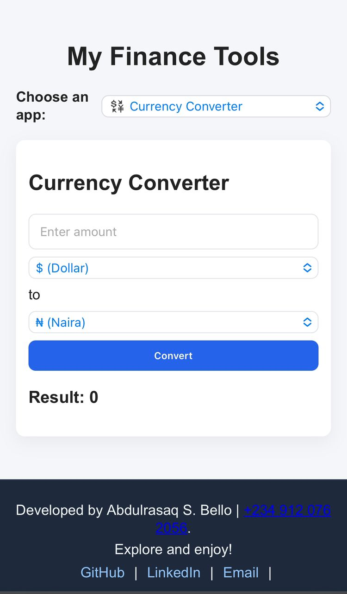
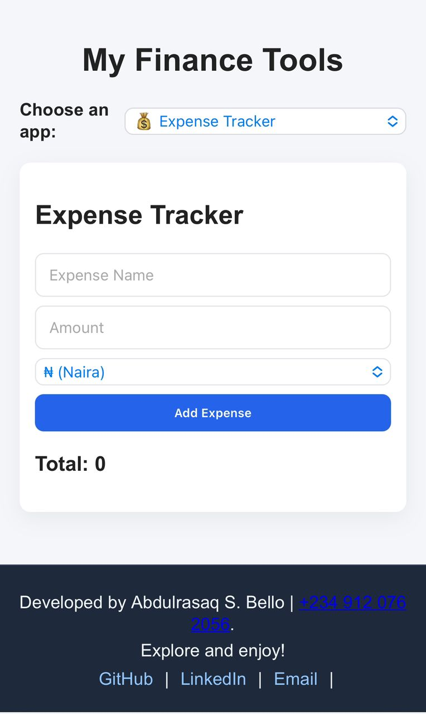

# 📊 Finance Tools: Expense Tracker & Currency Converter

A simple web app to help you manage daily expenses and convert currencies in real-time. Built using **HTML**, **CSS**, and **JavaScript**.

---

## 🚀 Features

- ✅ Track expenses with descriptions and amounts  
- ✅ View total balance and history  
- ✅ Delete individual transactions  
- ✅ Convert between currencies using live exchange rates  
- ✅ Responsive and mobile-friendly UI

---

📸 Screenshots

> _Screenshots of the app UI ( i added them in `/assets/` folder and updated the paths below)_

  
  
*Main interface of the finance tools app (expense tracker + currency converter)*

  Tech Stack

- **Frontend:** HTML, CSS, JavaScript

API --- https://open.er-api.com/v6/latest/USD

## 📁 Folder Structure

